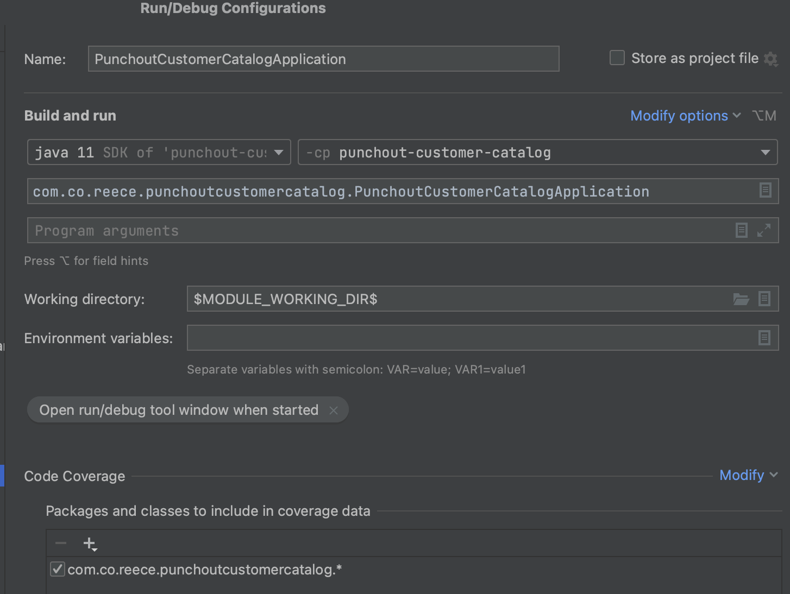
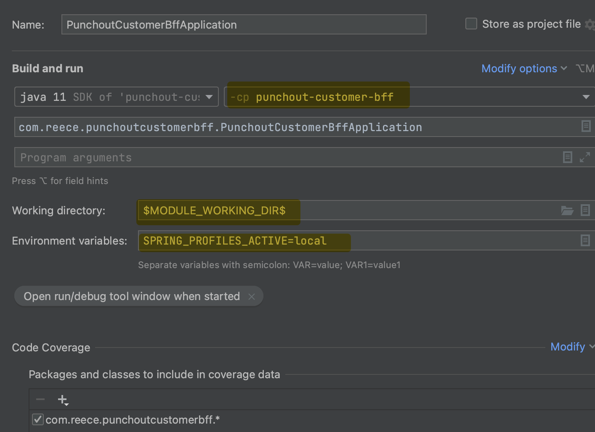

# Punchout Customer BFF

CircleCi Pipeline -> https://app.circleci.com/pipelines/github/morsco-reece/punchout-customer-bff

# Setup

See https://github.com/morsco-reece/punchout-wiki#setup for setup automation.

Import into IntelliJ using:

- File
- New
- Module From Existing Sources
- Select the project
- Select the type as "Maven"

# Runtime

## (1) Docker

You must first be running a local docker container of Postgres, which can be done using:

```
docker compose up -d
```


## (2) Run Main



...then end the runtime configuration to be the following and save it:




## (3) Endpoints

### /actuator/health

http://localhost:8080/actuator/health

```
{
  "status": "UP",
  "components": {
    "db": {
      "status": "UP",
      "details": {
        "database": "PostgreSQL",
        "validationQuery": "isValid()"
      }
    },
    "diskSpace": {
      "status": "UP",
      "details": {
        "total": 494384795648,
        "free": 333121630208,
        "threshold": 10485760,
        "exists": true
      }
    },
    "livenessState": {
      "status": "UP"
    },
    "ping": {
      "status": "UP"
    },
    "readinessState": {
      "status": "UP"
    }
  },
  "groups": [
    "liveness",
    "readiness"
  ]
}
```

### /swagger-ui/index.html

http://localhost:8080/swagger-ui/index.html

## (4) Refresh Test Data

The following script is used to refresh test customer data and related products:

```bash
./refresh-test-data.sh
```

