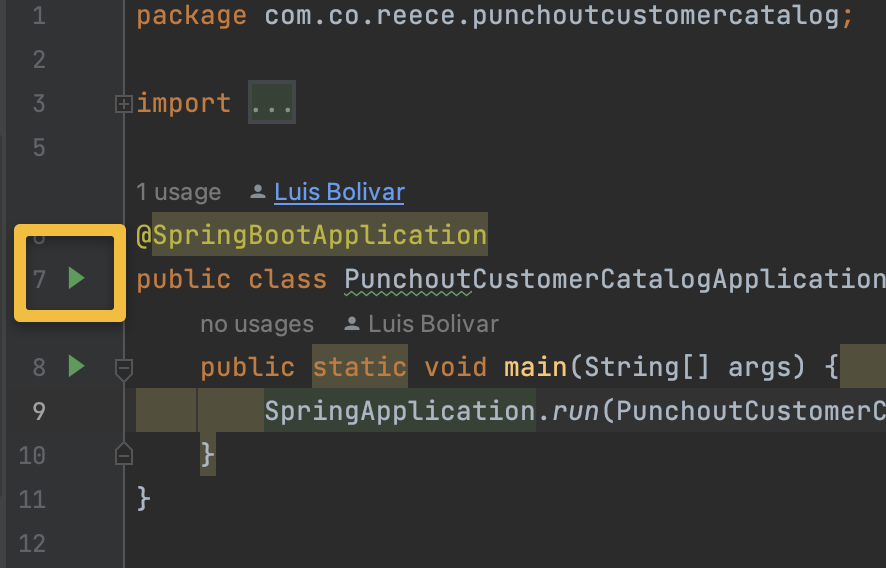
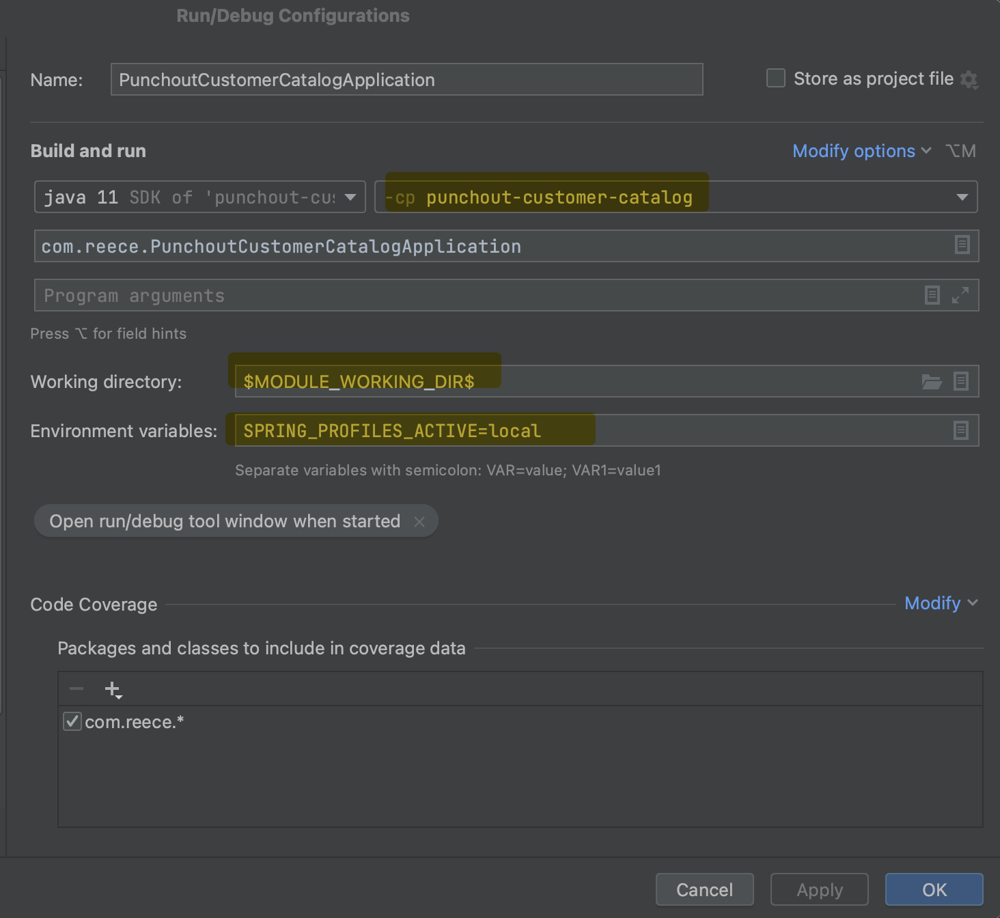
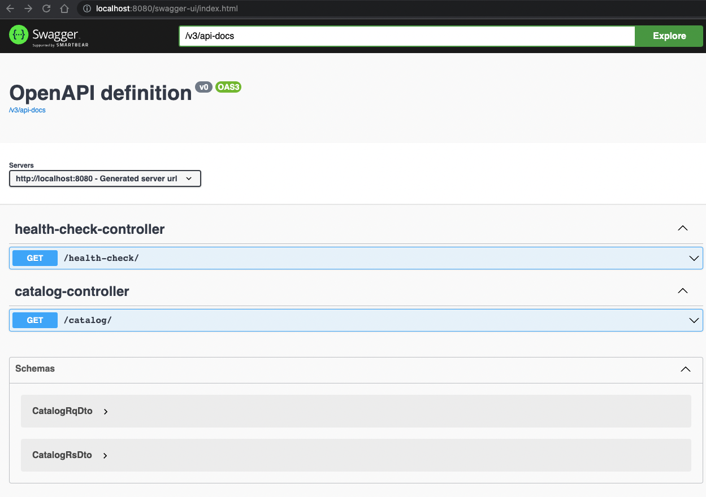
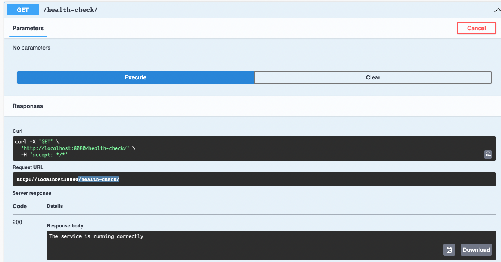
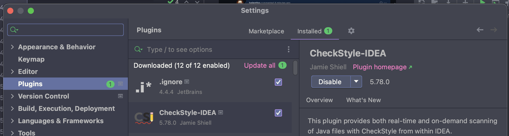
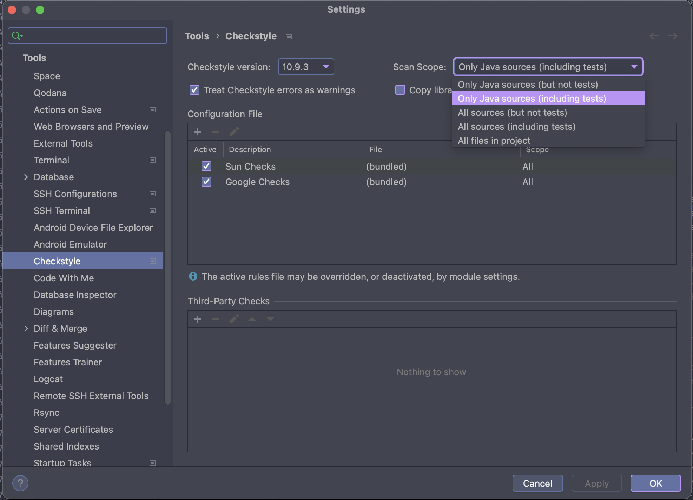
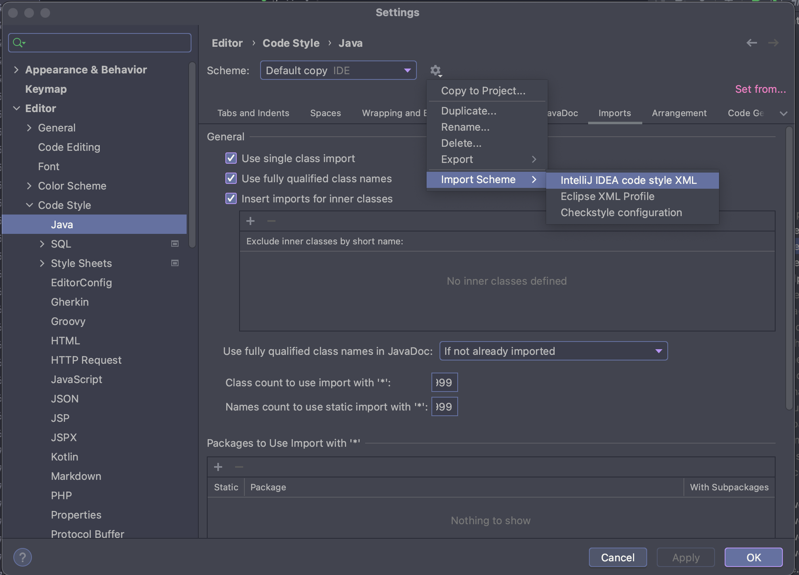
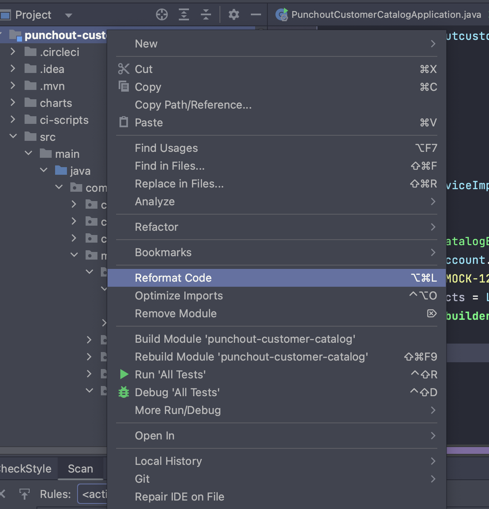
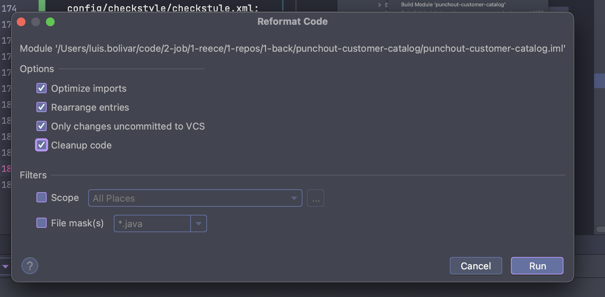

# punchout-customerLegacy-catalog

# Setup

See https://github.com/morsco-reece/punchout-wiki#setup for setup automation.

Import into IntelliJ using:

- File
- New
- Module From Existing Sources
- Select the project
- Select the type as "Maven"

# Runtime

## (1) Docker

You must first be running a local docker container of Postgres, which can be done using:

```bash
docker compose up -d
```

## (2) Run Main

Click on the Play button in the Main class of `PunchoutCustomerCatalogApplication`





## (3) Endpoints

### /actuator/health

http://localhost:8080/actuator/health

```json
{
  "status": "UP",
  "components": {
    "db": {
      "status": "UP",
      "details": {
        "database": "PostgreSQL",
        "validationQuery": "isValid()"
      }
    },
    "diskSpace": {
      "status": "UP",
      "details": {
        "total": 494384795648,
        "free": 333121630208,
        "threshold": 10485760,
        "exists": true
      }
    },
    "livenessState": {
      "status": "UP"
    },
    "ping": {
      "status": "UP"
    },
    "readinessState": {
      "status": "UP"
    }
  },
  "groups": [
    "liveness",
    "readiness"
  ]
}
```

### /swagger-ui/index.html

http://localhost:8080/swagger-ui/index.html



### /health-check



## (4) Refresh Test Data

The following script is used to refresh test customer data and related products:

```
./refresh-test-data.sh
```

# FAQ

### java: You aren't using a compiler supported by lombok, so lombok will not work and has been disabled.

Fixed by correcting the dependency:

```xml

<dependency>
    <groupId>org.projectlombok</groupId>
    <artifactId>lombok</artifactId>
    <version>1.18.26</version>
    <scope>provided</scope>
</dependency>
```

Reference: https://stackoverflow.com/questions/65128763/java-you-arent-using-a-compiler-supported-by-lombok-so-lombok-will-not-work-a

### Checkstyle IntellJ configuration:

1. download the plugin:
   
2. is to configure the IDE to automatically detect checkstyle errors as you type. This is done by import
   config/checkstyle/checkstule.xml:
   
3. is to configure your IDE to use the checkstyle rules, so that when you reformat code it does so using the correct
   indentation and style:
   
4. review the configuration in project about checkstyle:
   [PMD-configuration-java](https://reeceusa.atlassian.net/wiki/spaces/ECOMM/pages/1931182101/configuration+of+PMD1)
5. reformat code:
   
6. 
7. to check the checkStyle code: run ```mvn verify```.
