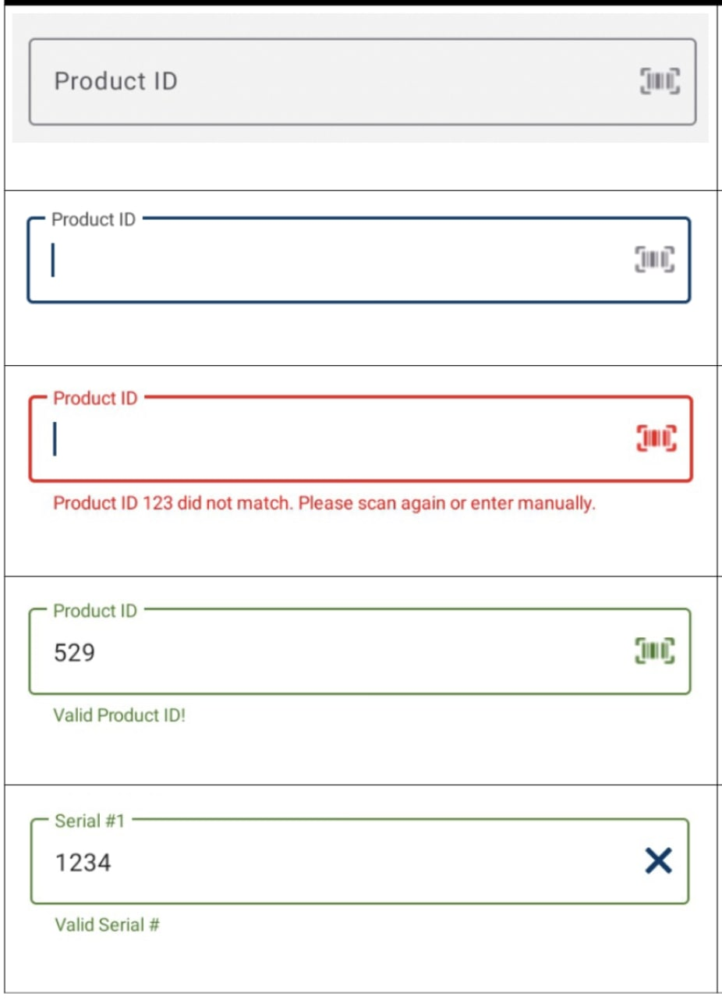

# Morsco Picking App

## Summary
This app was developed in order to help our branch associates fully pick orders using a mobile device. The user will be able to view, assign, complete an order pick, and stage the order with package quantities that connect back to the ERP. The user will also be able to flag products on the order for back order and pick in split quantities if required.

## Getting Started
To run the Picking App locally you will need to install Android Studio. Once installed, sync the project, build the app to generate graphql types and schemas, then run the app.

### Environment Variables
- `API_BASE_URL`: Used as the base url for requests to internal API. You can update the baseUrl for local development by updating the debug build setting in `app/build.gradle`

### Okta Permissions
In order to log into the development environment for the app you will need to have your `@morsco.com` email account added to the Okta Development environment.
- Reach out to Morsco IT to have your account added.
  -  Contact point: Matt Moses

### Android Studio Plugins
Install these plugins for use in the project. Go to `Android Studio -> Preferences -> Plugins`. Search for the PlugIns below.
- _GraphQL_ - An open-source data query and manipulation language for APIs, and a runtime for fulfilling queries with existing data
  - https://plugins.jetbrains.com/plugin/8097-graphql
- _Kotest_ - A flexible and comprehensive testing tool for Kotlin.
  - https://plugins.jetbrains.com/plugin/14080-kotest
- _Kotlin_ - A cross-platform, statically typed, general-purpose programming language with type inference.
  - https://plugins.jetbrains.com/plugin/6954-kotlin

### Helpful Documentation
Below is a list of useful introductions into the frameworks and technologies used in the project
- [GraphQL](https://medium.com/nerd-for-tech/android-tutorial-part-1-using-apollo-library-to-fetch-data-from-a-graphql-endpoint-61e8c58158de) - The primary method of data retrieval and processing in the app
- [MVVM](https://medium.com/codex/get-started-with-mvvm-in-android-959e7666caa5) - Model-View-ViewModel architectural pattern
- [Kotest](https://kotest.io/docs/framework/framework.html) - Unit Tests written in the project specifically use the [Describe Spec style](https://kotest.io/docs/framework/testing-styles.html#describe-spec)
- [Mockk](https://mockk.io/) - A mocking library for Kotlin for Unit Testing
- [Dagger / Hilt](https://developer.android.com/training/dependency-injection/hilt-android) - A dependency injection library for Android that reduces the boilerplate of doing manual dependency injection in your projec

Additionally, below are documents for app specific technologies and components
- [How to Update GraphQL](documentation/GraphQLUpdate.pdf) - directions on importing and updating GraphQL calls in the App.
- [How to Create an Order](documentation/HowToCreateAnOrder.pdf) - directions on creating an order for Picking that has various products with or without serial numbers.
- [Data Entry Input Component](documentation/PickingAppDataEntryInput.pdf) - a Picking App custom component for text entry that handles UI and behavior for a standard experience in the app
  - Example of component appearance / behavior 
  - 

### Code Style suggestions
- Use `dimens.xml` to set margins, indentations, etc.
- Use `regions` to mark sections of code.
- Use `DataBinding` (via ViewModels) for layouts.
  - Fragment files should be as small as possible.

## Project Overview

### Branching Strategy
This repository's branching strategy is based closely to `git-flow`. For more information please visit [here](https://www.atlassian.com/git/tutorials/comparing-workflows/gitflow-workflow#:~:text=Gitflow%20is%20a%20legacy%20Git,software%20development%20and%20DevOps%20practices). Below has an overview of the branch naming convention: 

#### **Active Branches**

| Branch Name | Description | Release Type |
|---|---|---|
| `development` | Default main branch for dev | _Alpha_ |
| `staging` | Production ready code ready for "UAT" testing | _Beta_ | 
| `master` | Code Currently in Latest Production Release | _Production_ |

- PR's into `development` should be Squash Merged with a single commit indicating the code change in that PR. Follow the [Pull Requests](#pull-requests) section for more information on how to create meaningful commits used to automatically generate change logs.
- PR's into `staging` will be created when a new _beta_ release of the picking app is ready. The release will create a build and use [Firebase App Distribution](https://firebase.google.com/docs/app-distribution) to distribute a build to beta testers. These should be merged using the "Rebase and Merge" strategy.
- PR's into `production` will be created when a new _production_ release of the Picking App is ready. These should be merged using the "Rebase and Merge" strategy.

#### **Working Branches**

| Branch Name  | Type | Description |
|---|---|---|
| `feat/`  | New Feature | Used to work on a branch for a new feature |
| `fix/`  | Bug Fix | Code changes to address a bug or defect |
| `docs/`  | Documentation | Additions or Changes to documentation |
| `chore/` | Chore | Misc. work items that relate to pipeline or configuration changes | 

Example: Jira Ticket #123 - Create a login page

New branch name: `feat/123-login-page`

### Pull Requests

When completing a task assigned to you, create a PR of your branch against the base branch `development`. Steps to complete: 
1. Create PR against `development`
2. Fill out PR template
3. If needed, perform a feature demo and code walkthrough with QA and at least 1 other engineer. 
4. Collaborate on code review feedback
5. When required checks have passed and have received PR approval, click **Squash and Merge**
6. (IMPORTANT): When prompted, change the commit message (top textbox) to a meaninful commit. See below: 
7. **Confirm Squash and Merge**

#### **Meaningful Commit Message for Squash and Merge**
We follow the [conventional commit](https://www.conventionalcommits.org/en/v1.0.0/) message strategy. This allows us to automate change logs for alpha, beta, and prod releases. These commit messages should communicate the intent of the change being introduced. Use your branch name to map to the commit message format: 

| Branch Name  | Commit Format | Example |
|---|---|---|
| `feat/`  | `feat: <desciption>` | `feat: Configure Okta Authentication for application` |
| `fix/`  | `fix: <desciption>` | `fix: Fixed CTA button to link to the correct page or screen` |
| `docs/`  | `docs: <description>` | `docs: Added Readme.md` |
| `chore/` | `chore: <description>` | `chore: Added Slack integration to release pipeline` |

In general, the commit should follow the following structure: 
```
<type>[optional scope]: <description>

[optional body]

[optional footer(s)]
```

### Build Versioning
This project uses the [fastlane semantic versioning plugin](https://github.com/xotahal/fastlane-plugin-semantic_release) to implement [Semantic Versioning](https://semver.org/) for this app. We also use postfix _-alpha_, _-beta_, to represent pre-production builds of the app to track testing efforts. 

### Native Android Picking Application

This repository contains the code for the native Android Picking application.
To run the gradle build, the command `gradlew assembleDebug` can be used.
This creates an APK named `module_name-debug.apk` in `project_name/module_name/build/outputs/apk/`.

Or to build the APK and immediately install it on a running emulator or connected device, instead invoke installDebug:

`gradlew installDebug`

